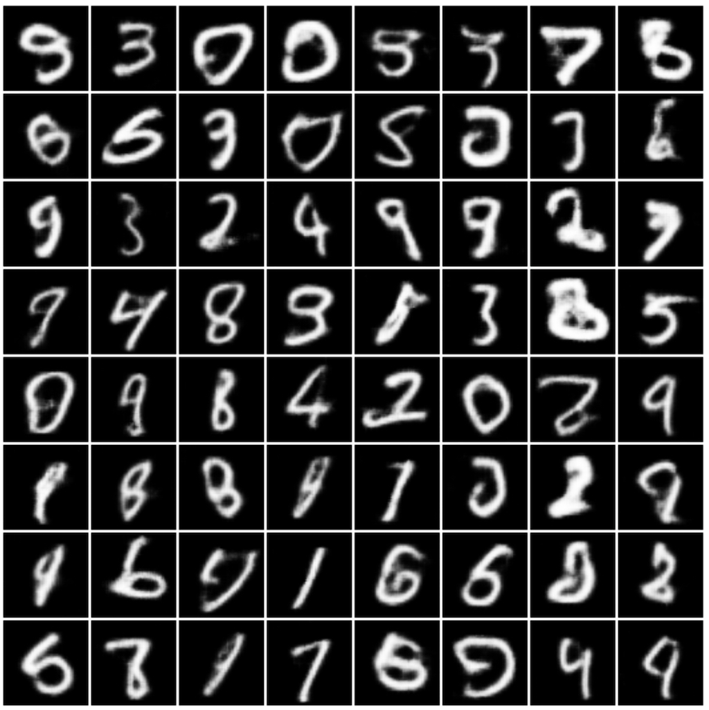
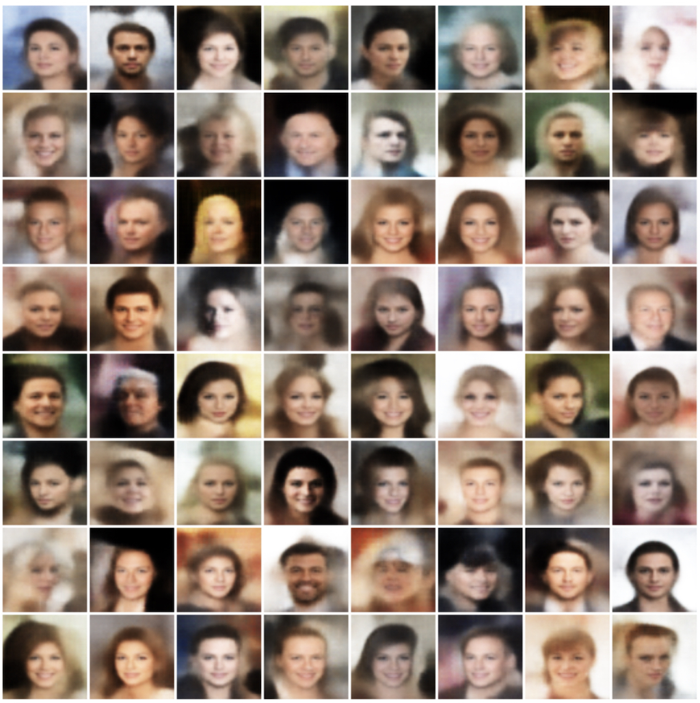

# torch-vae

## About

Author: Markus Enzweiler, markus.enzweiler@hs-esslingen.de

Convolutional variational autoencoder (VAE) implementation in PyTorch. Supported datasets include MNIST, CIFAR-10/100 and CelebA. 

See https://github.com/menzHSE/cv-ml-lecture-notebooks for interactive Jupyter notebooks using this package with additional explanations and visualizations. 

## Variational Autoencoder Implementation Overview

Good overviews of variational autoencoders are provided in [arXiv:1906.02691](https://arxiv.org/abs/1906.02691) and [arXiv:1312.6114](https://arxiv.org/abs/1312.6114).

In our implementation, the input image is not directly mapped to a single latent vector. Instead, it's transformed into a probability distribution within the latent space, from which we sample a latent vector for reconstruction. The process involves:

1. **Encoding to Probability Distribution**: 
   - The input image is linearly mapped to two vectors: 
     - A **mean vector**.
     - A **standard deviation vector**.
   - These vectors define a normal distribution in the latent space.

2. **Auxiliary Loss for Distribution Shape**: 
   - We ensure the latent space distribution resembles a zero-mean unit-variance Gaussian distribution (standard normal distribution).
   - An auxiliary loss, the Kullback-Leibler (KL) divergence between the mapped distribution and the standard normal distribution, is used in addition to the standard reconstruction loss
   - This loss guides the training to shape the latent distribution accordingly.
   - It ensures a well-structured and generalizable latent space for generating new images.

3. **Sampling and Decoding**: 
   - The variational approach allows for sampling from the defined distribution in the latent space.
   - These samples are then used by the decoder to generate new images.

4. **Reparametrization Trick**:
   - This trick enables backpropagation through random sampling, a crucial step in VAEs. Normally, backpropagating through a random sampling process from a distribution with mean ```mu``` and standard deviation ```sigma``` is challenging due to its nondeterministic nature.
   - The solution involves initially sampling random values from a standard normal distribution (mean 0, standard deviation 1). These values are then linearly transformed by multiplying with ```sigma``` and adding ```mu```. This process essentially samples from our target distribution with mean ```mu``` and standard deviation ```sigma```.
   - The key benefit of this approach is that the randomness (initial standard normal sampling) is separated from the learnable parameters (```mu``` and ```sigma```). ```Mu``` and ```sigma``` are deterministic and differentiable, allowing gradients with respect to them to be calculated during backpropagation. This enables the model to effectively learn from the data.


## Requirements
* torch
* torchvision
* torchinfo
* numpy
* Pillow

See [requirements.txt](requirements.txt). 

```pip install -r requirements.txt```


## Usage

### Model Training

Pretrained models for all datasets are available in the ```models``` directory. The models carry information of the maximum number of filters in the conv layers (```--max_filters```) and the number of latent dimensions (```--latent_dims```) in their filename. These models use three conv layers with 32/64/128 features (and corresponding transposed conv layers in the decoder) and 64 latent dimensions. To train a VAE model use ```python train.py```. 

```
python train.py  -h
usage: Train a VAE with PyTorch. [-h] [--cpu] [--seed SEED] [--batchsize BATCHSIZE] [--max_filters MAX_FILTERS]
                                 [--epochs EPOCHS] [--lr LR] [--dataset {mnist,cifar-10,cifar-100,celeb-a}] --latent_dims
                                 LATENT_DIMS

optional arguments:
  -h, --help            show this help message and exit
  --cpu                 Use CPU instead of GPU (cuda/mps) acceleration
  --seed SEED           Random seed
  --batchsize BATCHSIZE
                        Batch size for training
  --max_filters MAX_FILTERS
                        Maximum number of filters in the convolutional layers
  --epochs EPOCHS       Number of training epochs
  --lr LR               Learning rate
  --dataset {mnist,cifar-10,cifar-100,celeb-a}
                        Select the dataset to use (mnist, cifar-10, cifar-100, celeb-a)
  --latent_dims LATENT_DIMS
                        Number of latent dimensions (positive integer)
```
**Example**

```python train.py --batchsize=128 --epochs=100 --dataset=celeb-a --latent_dims=64```

### Reconstruction of Training / Test Data

Datasets can be reconstructed using ```python reconstruct.py```. Images depicting original and reconstructed data samples are written to the folder specified by ```--outdir```.

``` 
python reconstruct.py  -h
usage: Reconstruct data samples using a VAE with PyTorch. [-h] [--cpu] --model MODEL [--rec_testdata] [--dataset {mnist,cifar-10,cifar-100,celeb-a}]
                                                          --latent_dims LATENT_DIMS [--max_filters MAX_FILTERS] --outdir OUTDIR

optional arguments:
  -h, --help            show this help message and exit
  --cpu                 Use CPU instead of GPU (cuda/mps) acceleration
  --model MODEL         Model filename *.pth
  --rec_testdata        Reconstruct test split instead of training split
  --dataset {mnist,cifar-10,cifar-100,celeb-a}
                        Select the dataset to use (mnist, cifar-10, cifar-100, celeb-a)
  --latent_dims LATENT_DIMS
                        Number of latent dimensions (positive integer)
  --max_filters MAX_FILTERS
                        Maximum number of filters in the convolutional layers
  --outdir OUTDIR       Output directory for the generated samples
```


#### Examples

**Reconstructing MNIST**

```python reconstruct.py --model=models/mnist/vae_filters_0128_dims_0064.pth  --dataset=mnist  --latent_dims=64 --outdir=reconstructions/mnist```


**Reconstructing CelebA**

```python reconstruct.py --model=models/celeb-a/vae_filters_0128_dims_0064.pth  --dataset=celeb-a --latent_dims=64 --outdir=reconstructions/celeb-a```


### Generating Samples from the Model

The variational autoencoders are trained in a way that the distribution in latent space resembles a normal distribution (see above). To generate samples from the variational autoencoder, we can sample a random normally distributed latent vector and have the decoder generate an image from that. Use ```python generate.py``` to generate random samples. 


``` 
python generate.py -h
usage: Generate samples from a VAE with PyTorch. [-h] [--cpu] [--seed SEED] --model MODEL --latent_dims LATENT_DIMS [--max_filters MAX_FILTERS]
                                                 [--nsamples NSAMPLES] --outdir OUTDIR [--nimg_channels NIMG_CHANNELS]

optional arguments:
  -h, --help            show this help message and exit
  --cpu                 Use CPU instead of GPU (cuda/mps) acceleration
  --seed SEED           Random seed
  --model MODEL         Model filename *.pth
  --latent_dims LATENT_DIMS
                        Number of latent dimensions (positive integer)
  --max_filters MAX_FILTERS
                        Maximum number of filters in the convolutional layers
  --nsamples NSAMPLES   Number of samples to generate
  --outdir OUTDIR       Output directory for the generated samples
  --nimg_channels NIMG_CHANNELS
                        Number of image channels (1 for grayscale, 3 for RGB)
```

#### Examples

**Sample from the VAE models trained on MNIST**

```python generate.py  --model=models/mnist/vae_filters_0128_dims_0064.pth  --latent_dims=64 --outdir=./samples/mnist --nimg_channels=1 --nsamples=64``` 




**Sample from the VAE models trained on CelebA**

```python generate.py  --model=models/celeb-a/vae_filters_0128_dims_0064.pth  --latent_dims=64 --outdir=./samples/celeb-a/ --nimg_channels=3 --nsamples=64```



